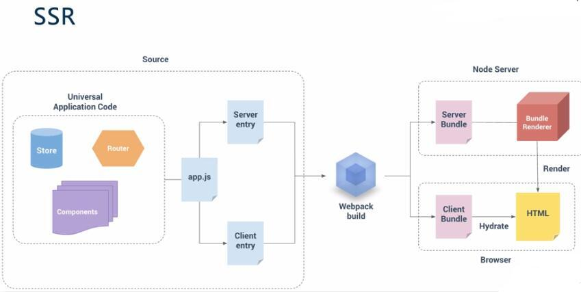
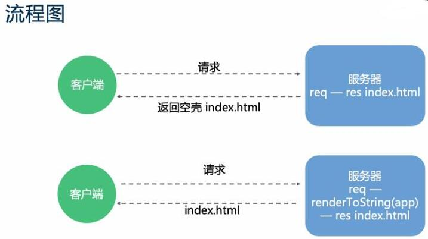

## Nuxt核心原理是什么

> 前言：我们前面章节讲了我们`Nuxt`要去解决的一个问题，那这节课我们来看下`Nuxt`的核心或者说是我们的`SSR`
的核心原理可能会更加贴切一些好让大家明白整个的运行流程，那即便我们现在不用但我们也需要知道它的一个流程。

这是我们`SSR`Vue的一个官网的一个流程图可能很多同学不知道其实我们Vue官网是有一个独立的`SSR`的域名里面有一整套的解决方案。

那实际上就是我们在打包我们的业务代码的时候我们是提供了两个的入口文件，一个是供我们的`Server`端就是我们的服务器端使用的一个是供我们的客户端就是我们浏览器使用的一个入口文件。

服务端的入口文件那主要是返回我们新创建的`Vue`的实例，那我们客户端的一个入口文件它其实就是将我们的`Vue`实例挂载到一个指定的DOM元素上我们平时开发的都是使用的我们的一个客户端，对这样的一个入口文件你可以这样认为，那在`webpack`打包之后呢它会生成两个`Bundle`文件就是我们生产之后的文件，那服务器会按照我们的一个请求在`Node`去生成我们预渲染的我们HTML然后返回到我们请求的一个客户端完成我们初始的一个渲染，虽然说我们页面上已经展示出来了我们的一个渲染的效果但是它上面的一些点击按钮啊什么的还是不可用的，这时候我们还是依然需要我们客户端的一个`Bundle`文件进行混合然后将我们的HTML完全由我们的`Vue`管理托管我们的一个动态DOM然后使我们之后能够响应后续的一个数据变化，所以说不管说你服务端是否帮我们渲染了你客户端依然要去走这样的一个流程的不然你的页面是不可点击的不可交互的。

那这里有一个更简单的流程图，第一个就是上面的我们不用`SSR`的时候就是直接返回我们一个空壳的`index.html`，使用我们的`SSR`的时候那我们的服务器会根据我们的`URL`通过我们的一个`renderToString`来去渲染我们的组件然后得到的字符串会放到我们的`index.html`然后一起返回给我们的客户端，这是一个非常简单的一个流程图帮助大家去理解。

