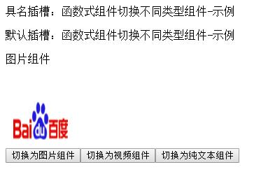

## 函数式组件

`Vue.js`提供了一个`functional`的布尔值选项，设置为true可以使组件无状态和无实例，也就是没有`data`和`this`上下文。这样用`render`函数渲染返回虚拟节点可以更容易渲染，因为函数化组件只是一个函数，渲染开销要小很多。


使用函数化组件时，`render`函数提供了第二个参数`context`来提供临时上下文。组件需要的`data`、`props`、`slots`、`children`、`parent`都是通过这个临时上下文来传递，比如 `this.level`要改写为`context.props.level`，`this.$slots.default`改写为`context.children`。

###### 注意：

context.default 相当于 context.slots().default

区别：

```
<smart-item :data="data">
  <p v-slot:foo>first</p>
  <p>second</p>
</smart-item>
```
children 会返回给你两个段落标签，而 slots().default 只会传递第二个匿名段落标签。


