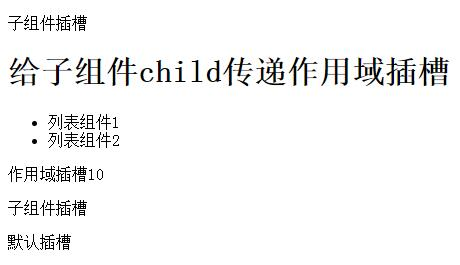

## render函数中怎么使用插槽slot和作用域插槽scopedSlots

#### 默认插槽

```
<template>
  <div>
    <slot></slot>
  </div>
</template>
```

```
render: function(createElement){
    // `<div><slot></slot></div>`
    return createElement('div', this.$slots.default)
}
```

#### 具名插槽

```
<template>
  <div>
    <slot name="header"></slot>
  </div>
</template>
```

```
render: function(createElement){
    // `<div><slot name="header"></slot></div>`
    return createElement('div', this.$slots.header)
}
```

#### 作用域插槽

TodoList.vue
```
 render: function (createElement) {
    data(){
      return {
        user: { name: '小猫咪', status: false }
      }
    },
    return createElement('div',{
      this.$scopedSlots.preIcon(this.user)
    })
 }
```

Index.vue

```
<template>
  <todo-list>
    <template v-slot:preIcon="{name, status}">
      <h1 v-if="awesome">Vue is awesome!</h1>
      <span v-if="status">跑步</span>
      <span v-else>散步</span>
    </template>
  </todo-list>
</template>
```

---


#### 综合示例：

```
<template>
  <parent-node ref="parent-ref">
    <template v-slot:normal_name_slot>
      <p>子组件插槽</p>
    </template>
    <template v-slot:scope_slot="num">
      <p>作用域插槽{{num}}</p>
    </template>
    <template v-slot:default>
      <p>默认插槽</p>
    </template>
  </parent-node>
</template>
<script>
import { parentNode } from './RenderItem.js';
export default {
  components: {
    parentNode
  },
}
</script>
```

RenderItem.js
```
var grandsonNode = {
  mounted () {},
  render: function (createElement) {
    return createElement(
      'p',
      {
        attrs: {
          id: 'grandson'
        },
        // 给插槽得 default 起一个别名，后面就用 grandson_slot 来代替 default
        slot: 'grandson_slot'
      },
      [this.$slots.grandson_slot]
    );
  }
};

var childNode = {
  mounted () {},
  render: function (createElement) {
    return createElement(
      'div',
      {
        attrs: {
          id: 'child_id'
        }
      },
      [
        this.$scopedSlots.child_scope_slot(),
        createElement('ul', [
          createElement('li', ['列表组件1']),
          createElement('li', ['列表组件2'])
        ])
      ]
    );
  }
};

var parentNode = {
  data () {
    return {
      user: {
        name: '小明'
      }
    };
  },
  mounted () {},
  render: function (createElement) {
    return createElement(
      'div',
      {
        attrs: {
          id: 'parent_id'
        }
      },
      [
        createElement(grandsonNode, [
          createElement(
            'span',
            {
              slot: 'grandson_slot'
            },
            '子组件插槽'
          )
        ]),
        createElement(
          childNode,
          {
            scopedSlots: {
              child_scope_slot: function (props) {
                return createElement('h1', ['给子组件child传递作用域插槽']);
              }
            }
          },
          []
        ),
        this.$scopedSlots.scope_slot(10),
        this.$slots.normal_name_slot,
        this.$slots.default
      ]
    );
  }
};

export { grandsonNode, childNode, parentNode };

```



先说一下函数中的$slots吧,这个用起来很简单,直接获取到组件中对应的插槽虚拟节点.this.$slots.插槽名称.

```
<div id="app">
	<cus-node>
		<template v-slot:content>
			Hello everyone, I'm content slot!
		</template>
	</cus-node>
</div>
<script type="text/javascript">
	Vue.component ("cus-node", {
		render: function (createElement) {
			return createElement ("div", [
				createElement ("h1", "the title"),
                                //这里直接把上面template中的内容搞到p标签里面
				createElement ("p", this.$slots.content)
			]);
		}
	});
 
	var vm = new Vue ({
		el: "#app"
	});
</script>

```

下面来看一下this.$scopedSlots的用法和作用, 个人认为,他的作用是向插槽内传递参数,代码如下:

```
<div id="app">
		<cus-node>
			<template v-slot:title="datas">
				<div>
					new title: today is a special day <br />
					old title: {{datas.name}}
				</div>
			</template>
			<template v-slot:content>
				he content slot
			</template>
		</cus-node>
	</div>
	<script type="text/javascript">
		Vue.component ("cus-node", {
			render: function (createElement) {
				//切记, 插槽如上面的写法: v-slot:title="datas"酱紫是无法使用this.$slots获取的!!!
				console.log (this.$slots.title);//undefined
				return createElement ("div", [
					//把title插槽内容放在h1标签中,并向title插槽传递一个参数name
					createElement ("h1", this.$scopedSlots.title ({
						name: this.name
					})),
					//把content插槽植入新创建的p之中
					createElement ("p", this.$slots.content)
				]);
			},
			data: function () {
				return {
					name: "component data title"
				}
			}
		});
 
		var vm = new Vue ({
			el: "#app"
		});
	</script>
```

this.$scopedSlots同样是获取到插槽内容,比this.$slots厉害的一点是他可以向插槽中传递参数,只需要在调用的时候传递一个参数对象就好了.值得注意的是,父组件插入插槽标签的时候,如果使用属性v-slot:name="datas"的方式获取参数时,this.$slots是获取不到内容的,打印为undefined.

接下来,看一下大Boss:scopedSlots属性.

上面两个都是获取到父组件中创建的插槽,而scopedSlots属性是创建一个插槽,当在渲染函数中创建自定义组件时,可以使用这个属性创建一个插槽进去.直接上代码吧:

```
<!DOCTYPE html>
<html>
<head>
	<script src="https://cdn.jsdelivr.net/npm/vue/dist/vue.js"></script>
	<title>vue pro</title>
	<style type="text/css">
	</style>
</head>
<body>
	<div id="app">
		<cus-node2>origin cus-node2</cus-node2>
	</div>
	<script type="text/javascript">
		//定义组件cus-node1
		Vue.component ("cus-node1", {
			//向default插槽传递一个text参数,当没有default插槽时,展示cus-node1 default slot
			template: "<div>this is cus-node1<slot :text='text'>cus-node1 default slot</slot></div>",
			data: function () {
				return {
					text: "I'm cus-node1.text"
				}
			}
		});
		//定义组件cus-node2
		Vue.component ("cus-node2", {
			render: function (createElement) {
				//创建一个cus-node1标签
				return createElement ("cus-node1", {
					scopedSlots: {
						//创建一个default插槽插入cus-node1中
						default: function (props) {
							//此处props为cus-node1组件向default插槽传递的参数
							//插槽内容是一个span标签,如果cus-node1有对插槽传递text参数时,就展示出来;否则展示props.text is null
							return createElement ("span", props.text || "props.text is null");
						}
					}
				});
			}
		});
 
		var vm = new Vue ({
			el: "#app"
		});
	</script>
</body>
</html>
```
